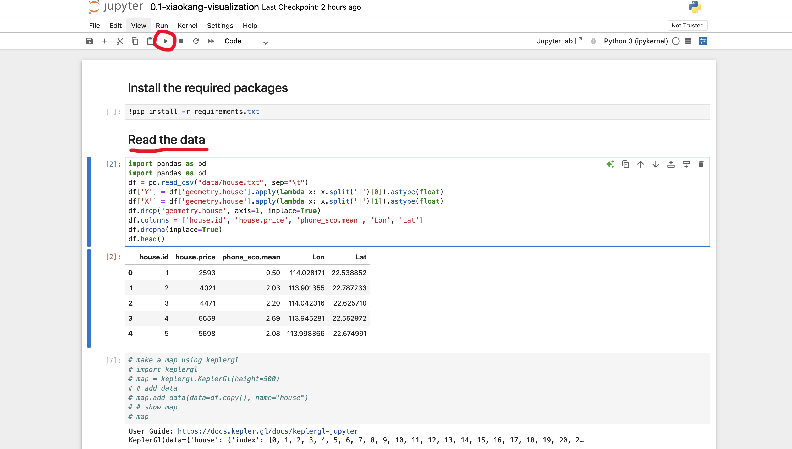
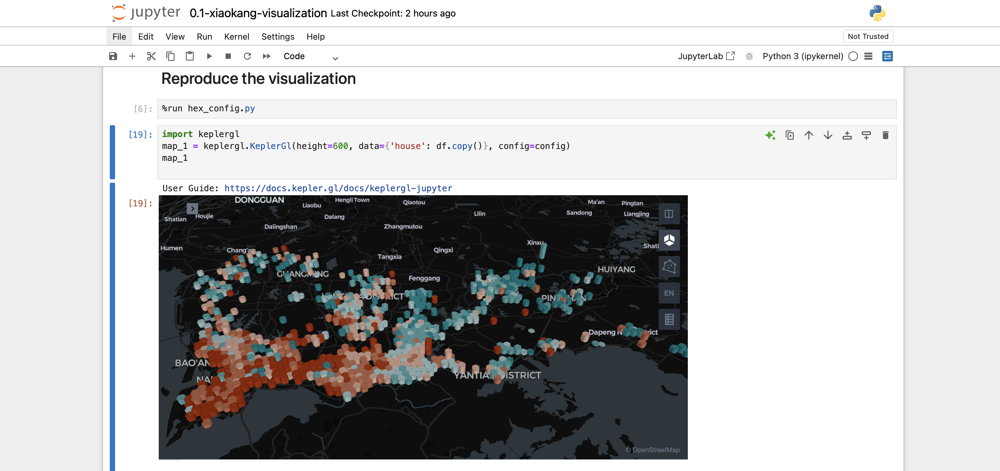

# 调用keplerGL库绘画3D地图指南（使用jupyter notebook打开并运行.ipynb文件）

## 1.配置环境
在电脑中安装Python 3.12(其他Python版本可能也能运行，Windows与Linux系统都一样)

## 2.安装工具包
以Windows为例，打开cmd，进入文件夹所在的位置(即requirements.txt所在文件夹)，在终端运行命令
`pip install -r requirements.txt`， 为.ipynb文件安装所需工具包(若pip无法使用再尝试使用pip3)

## 3.安装jupter notebook
根据[jupter notebook安装教程](https://blog.csdn.net/m0_68678046/article/details/129703799?ops_request_misc=%257B%2522request%255Fid%2522%253A%2522f8eb467449cc32ac9703be43dfe8afb5%2522%252C%2522scm%2522%253A%252220140713.130102334..%2522%257D&request_id=f8eb467449cc32ac9703be43dfe8afb5&biz_id=0&utm_medium=distribute.pc_search_result.none-task-blog-2~all~sobaiduend~default-2-129703799-null-null.142^v101^pc_search_result_base8&utm_term=%E5%A6%82%E4%BD%95%E5%AE%89%E8%A3%85jupter%20notebook&spm=1018.2226.3001.4187)
安装并运行软件(如果对虚拟环境不了解，推荐使用情况二)

## 4.如何运行.ipynb文件
1）逐步运行

鼠标点击Read the data下得kernel，点击红圈中的button运行该kernel中的代码，按顺序逐步对每个kernel中代码进行运行。

2）直接全部运行

选择Read the data下得kernel，点击红线标识运行方式，一步直接运行该kernel及以后得代码

## 5.运行结果展示

